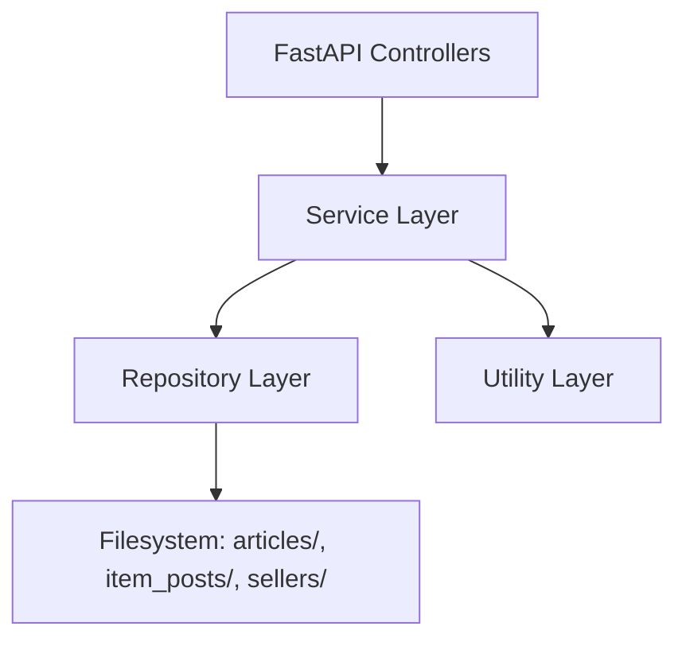
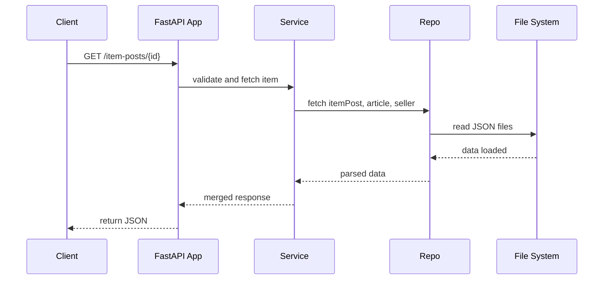

# 🧠 Backend Documentation

## 📘 Overview

This document describes the backend implementation that powers the product detail page, following a clean layered architecture based on FastAPI. It exposes a fully browsable **Swagger UI** by default, thanks to FastAPI's automatic OpenAPI integration.

## 🛠️ Tech Stack

* 🐍 **Python 3.10**: The core programming language used for all backend logic.
* 🚀 **FastAPI**: A modern web framework for building APIs with automatic OpenAPI docs and high performance.
* 🧰 **Pydantic**: Defines request and response schemas with type validation and serialization.
* 🧪 **Pytest**: Testing framework ensuring unit and integration test coverage.
* 🔥 **Uvicorn**: ASGI server used for development and production.
* 🔄 **GitHub Actions**: Runs tests and coverage reports on every commit.

## 🧱 Architecture

The project follows a layered design pattern, with code organized in:

```plaintext
app/
├── controllers/
│   ├── article_controller.py
│   ├── item_post_controller.py
│   └── seller_controller.py
├── services/
│   ├── article_service.py
│   ├── item_post_service.py
│   └── seller_service.py
├── repositories/
│   ├── article_repository.py
│   ├── item_post_repository.py
│   └── seller_repository.py
├── utils/
│   └── file_repository_utils.py
├── domain/
│   └── enums/...
└── core/constants.py
```

### 🧩 Layer Responsibilities



* **Controllers**: Define API routes, validate inputs, and marshal output. E.g., `item_post_controller.py`
* **Services**: Orchestrate business logic. E.g., `item_post_service.py`
* **Repositories**: File access and parsing logic. E.g., `item_post_repository.py`
* **Utils**: Reusable helpers. E.g., path joins, filters, pagination logic

## 🔍 Endpoints

```plaintext
GET /                         → Root check
GET /item-posts/              → Paginated list of item posts
GET /item-posts/{id}          → Full detail (merged with article & seller)
GET /articles/{id}            → Article detail
GET /articles/{id}/images     → List image filenames
GET /articles/{id}/images/{image} → Serve article image
GET /sellers/{id}             → Seller detail
```

## 🔄 Data Flow Sequence



## ✅ Test Strategy

* Located in `tests/`

  * `test_item_post_controller.py`
  * `test_article_controller.py`
  * `test_seller_controller.py`
* Run via:

```bash
pytest --cov=src tests/
```

* Coverage is **>90%**
* Tests validate routing, merging logic, file loading, and edge cases

## ✅ Benefits of Layered Architecture

* 🔍 **Separation of concerns**: Each layer has a single responsibility
* 🔁 **Testability**: Services and repos can be tested independently
* 🔧 **Maintainability**: Easy to locate logic for any component
* 🔌 **Reusability**: Shared logic lives in `utils/` and `domain/`
* 🧪 **High coverage**: Structure facilitates fine-grained testing

## 🔮 Future Improvements

* Replace file-based storage with PostgreSQL
* Add filtering/sorting to item post queries
* Integrate Redis for image metadata caching
* Add authentication for dashboard features
