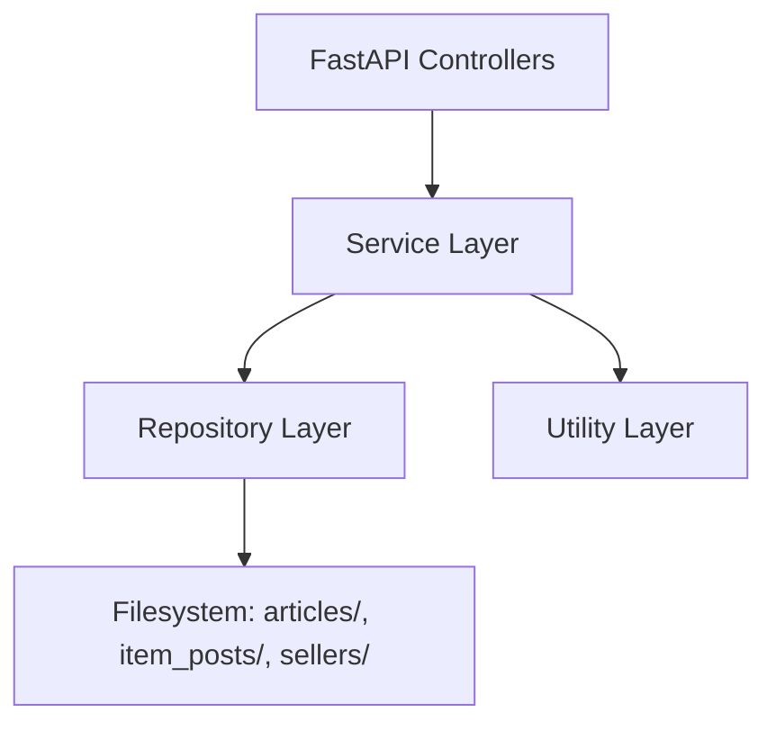
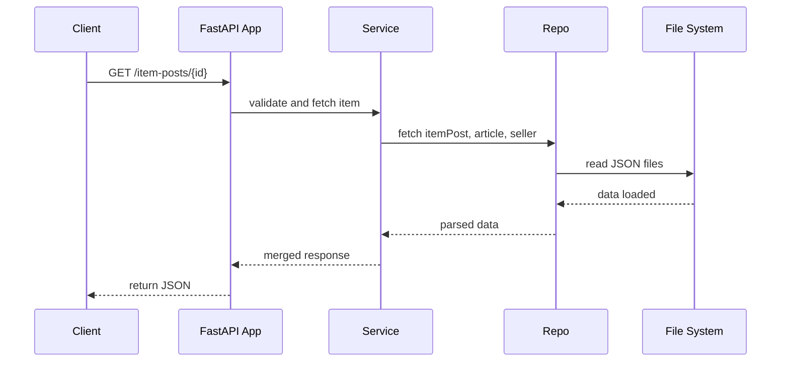

# 🧠 Backend Documentation

## 📘 Overview

This document describes the backend implementation that powers the product detail page, following a clean layered architecture based on FastAPI. It exposes a fully browsable **Swagger UI** by default, thanks to FastAPI's automatic OpenAPI integration.

## 🛠️ Tech Stack

* 🐍 **Python 3.10**: The core programming language used for all backend logic.
* 🚀 **FastAPI**: A modern web framework for building APIs with automatic OpenAPI docs and high performance.
* 🧰 **Pydantic**: Defines request and response schemas with type validation and serialization.
* 🧪 **Pytest**: Testing framework ensuring unit and integration test coverage.
* 🔥 **Uvicorn**: ASGI server used for development and production.
* 📦 **Dockerized Testing**: While GitHub Actions are not configured yet, the backend is containerized, allowing consistent local testing with Docker.

## 🧱 Architecture

The project follows a layered design pattern, with code organized in:

```
app/
├── controllers/
│   ├── article_controller.py
│   ├── item_post_controller.py
│   └── seller_controller.py
├── services/
│   ├── article_service.py
│   ├── item_post_service.py
│   └── seller_service.py
├── repositories/
│   ├── article_repository.py
│   ├── item_post_repository.py
│   └── seller_repository.py
├── utils/
│   └── file_repository_utils.py
├── domain/
│   └── enums/...
└── core/constants.py
```

### 🧩 Layer Responsibilities



* **Controllers**: Define API routes, validate inputs, and marshal output. E.g., `item_post_controller.py`
* **Services**: Orchestrate business logic. E.g., `item_post_service.py`
* **Repositories**: File access and parsing logic. E.g., `item_post_repository.py`
* **Utils**: Reusable helpers. E.g., path joins, filters, pagination logic

## 🔍 Endpoints

Each endpoint is designed to serve specific parts of the product detail page with clear responsibilities and efficient access to the data stored in the filesystem.

```
GET /                             → Health check; confirms that the API is up and running.
GET /item-posts/                  → Returns a paginated list of all item posts with basic data (price, condition, stock).
GET /item-posts/{id}              → Returns a full item post detail, including merged data from article and seller.
GET /articles/{id}                → Retrieves detailed metadata for a single article (title, brand, attributes, etc.).
GET /articles/{id}/images         → Lists all image filenames for a specific article, grouped by variant.
GET /articles/{id}/images/{image} → Serves the binary content of a specific image belonging to an article.
GET /sellers/{id}                 → Retrieves full metadata for a seller (name, reputation, product count, etc.).
```

## 📦 Enumerations

The backend defines strict enumerations to ensure valid values for critical fields in `item_post.json`, avoiding inconsistencies or typos in payment and delivery options.

### PaymentMethodCategory

Defines categories of available payment methods:

* `credit_card`
* `debit_card`
* `cash`
* `account_money`
* `bank_transfer`

### CreditCardMethod, DebitCardMethod, etc.

Enumerate allowed methods within each category, for example:

* `CreditCardMethod`: `visa`, `mastercard`, `naranja_x`, `amex`, etc.
* `DebitCardMethod`: `maestro`, `visa_debit`, etc.
* `CashMethod`: `rapipago`, `pago_facil`
* `AccountMoneyMethod`: `mercado_pago_balance`
* `BankTransferMethod`: `debin`

### DeliveryOption

Literal enum that defines valid delivery types:

* `home_delivery:standard`
* `pickup_point:mail_branch`
* `seller_store_pickup:direct`

These enums are referenced directly in Pydantic models and validated at runtime to prevent invalid API responses.

## 🔄 Data Flow Sequence



## ✅ Test Strategy

### 🐳 Running Tests with Docker

You can run the tests inside the container with:

```bash
docker build -t meli-backend .
docker run --rm meli-backend pytest --cov=src tests/
```

This ensures reproducible test runs without needing to install dependencies locally.

* Located in `tests/`

  * `test_item_post_controller.py`
  * `test_article_controller.py`
  * `test_seller_controller.py`

* Run locally with:

```bash
pytest --cov=src tests/
```

* Coverage is **>90%**
* Tests validate routing, merging logic, file loading, and edge cases

## ✅ Benefits of Layered Architecture

* 🔍 **Separation of concerns**: Each layer has a single responsibility
* 🔁 **Testability**: Services and repos can be tested independently
* 🔧 **Maintainability**: Easy to locate logic for any component
* 🔌 **Reusability**: Shared logic lives in `utils/` and `domain/`
* 🧪 **High coverage**: Structure facilitates fine-grained testing

## 🔮 Future Improvements

* Replace file-based storage with PostgreSQL
* Add filtering/sorting to item post queries
* Integrate Redis for image metadata caching
* Add authentication for dashboard features
