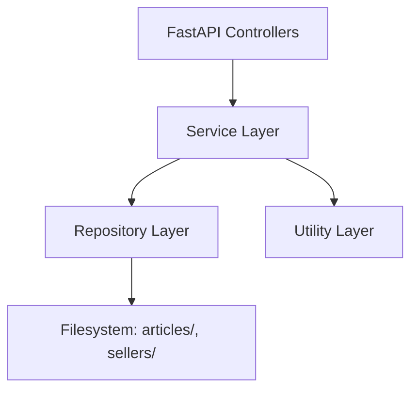
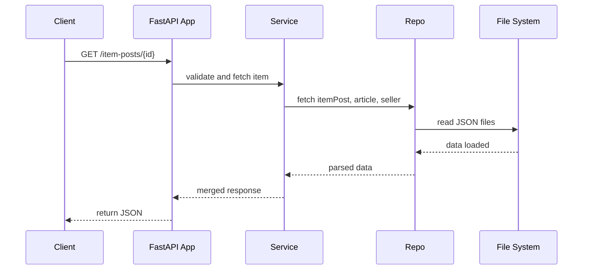

# 🧠 Backend Documentation

## 📘 Overview

This document describes the backend implementation that powers the product detail page, following a clean layered architecture based on FastAPI.

## 🛠️ Tech Stack

* 🐍 **Python 3.10**: The core programming language used for all backend logic.
* 🚀 **FastAPI**: A modern web framework for building APIs with automatic OpenAPI documentation and high performance.
* 🧰 **Pydantic**: Used for defining request and response schemas, as well as internal models that enforce type safety and validation.
* 🧪 **Pytest**: The testing framework used to ensure backend reliability.
* 🔥 **Uvicorn**: The ASGI server that runs FastAPI applications in production and development.
* 🔄 **GitHub Actions**: Automates tests and coverage reports on every push via CI/CD.

## 🧱 Architecture



* **Controller layer**: Handles HTTP requests, validates input, and delegates to the service.
* **Service layer**: Orchestrates business logic.
* **Repository layer**: Handles access to the file-based data store.
* **Utils**: Contains helper functions (e.g., pagination, path handling) shared across services.

This layered model ensures testability, separation of concerns, and clean scalability.

## 🔍 Endpoints

* `GET /item-posts/{item_post_id}`: Returns merged item post, article, and seller info.
* `GET /articles/{article_id}/images`: Lists available image filenames.
* `GET /articles/{article_id}/images/{image}`: Serves binary image content.
* `GET /item-posts/`: Paginates over all available item posts.

## 🧪 Test Coverage

Run test suite with coverage:

```bash
pytest --cov=src tests/
```

> Current coverage: **>90%**, including service logic, controller input validation, and repository operations.

## 🔄 Data Flow Sequence



## 🧠 Design Decisions

* Used file-based storage for easier local testing and faster iteration.
* Adopted a clean layered model (controller-service-repo-utils) for long-term maintainability.
* `Pydantic` is used to define all data models, enforcing type constraints and auto-generating API docs.
* Utility functions abstract repetitive logic like path resolution and data filtering.

## 🚧 Challenges

* Coordinating consistent data across `articles/`, `sellers/`, and `item_posts/` folders.
* Building a clean service abstraction while avoiding tight coupling.
* Maintaining high test coverage across all logic layers.

## 🔮 Future Improvements

* Switch to a persistent database (e.g., PostgreSQL) for dynamic data handling.
* Add image caching and/or CDN proxying.
* Build additional endpoints for filtering, search, and seller analytics.
