# 🧾 Data Structure Documentation

## 📘 Overview

This document explains how domain objects in the marketplace are represented and persisted in the filesystem, using structured JSON files within the `data/` folder. The system models three main entities: `Article`, `ItemPost`, and `Seller`.

---

## 🗂️ Folder Layout

```plaintext
data/
├── articles/
│   └── <article_id>/
│       ├── data.json
│       └── images/
├── item_posts/
│   └── <item_post_id>.json
├── sellers/
│   └── <seller_id>/
│       ├── data.json
│       └── images/
│           ├── logo.webp
│           └── banner.webp
```

Each JSON file reflects a well-structured data model. Images are stored as static files, separate from metadata.

---

## 🧠 Entity Descriptions

### Article

Saved under: `articles/<article_id>/data.json`

Includes structured attributes, short highlights, full description, category hierarchy, brand, warranty, and review metrics. Example fields:

* `attributes`: Nested technical specs
* `short_info`: Display-ready highlights
* `category_path`: Hierarchical list of category names

### ItemPost

Saved under: `item_posts/<item_post_id>.json`

Represents a concrete offering of an article by a seller. Includes:

* `price`, `currency`, `stock`, `condition`
* `payment_methods`, `delivery_options` (validated via enums)
* `variants`: List of sibling `item_post` IDs to display other options

### Seller

Saved under: `sellers/<seller_id>/data.json`

Includes:

* `name`, `reputation`, `products_count`
* `metrics`: flags like `on_time_dispatch`, `good_attention`
* `tax_invoice` and official store status

---

## 🧬 Entity Relationship Diagram


---

## 🔄 Data Composition Flow

```mermaid
graph LR
  A[ItemPost JSON] --> B[article_id ➜ Article JSON]
  A --> C[seller_id ➜ Seller JSON]
  B --> D[images/ folder]
  C --> E[logo & banner]
```



The backend merges these elements at runtime into a single detailed response object for the product detail page.

---

## 📌 Notes

* Article IDs are reused across item posts by different sellers.
* Variants are linked manually between item posts.
* Enum constraints ensure payment/delivery consistency across the dataset.

---

## 📦 Related Files

* `delivery_option.py`: Defines allowed delivery methods
* `payment_method.py`: Defines categories and subtypes of payments
* `item_post_controller.py`: Composes final merged response from three sources

---

## 🔮 Future Enhancements

* Add field validation on load
* Move variants into a proper `article_variant_group`
* Index data for faster lookup
