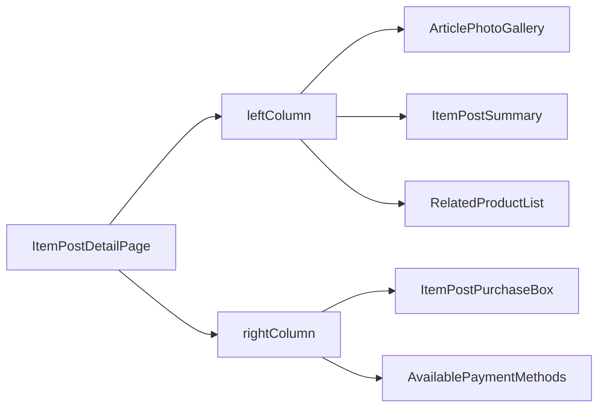

# Frontend Documentation

## Overview

This document describes the frontend implementation of the product detail page, modeled after Mercado Libre’s interface. It follows a component-based design using React with modular CSS and Vite.

## Tech Stack

* React.js
* React Router
* Vite
* CSS Modules

## Structure

The layout is divided into a two-column design:

### Components

* `ArticlePhotoGallery`: Displays image carousel.
* `ItemPostSummary`: Shows article title, rating, and key info.
* `ItemPostPurchaseBox`: Manages stock, quantity selection, delivery options, and seller reputation.
* `RelatedProductList`: Fetches related `itemPosts` excluding current.
* `AvailablePaymentMethods`: Displays payment method icons, only if corresponding image exists in `public/icons/payment/`. Icons currently supported include: `master-card.svg`, `mercado-pago.svg`, `visa-debit.svg`, and `visa.svg`.

### Design Decisions

* Components split by layout column to isolate responsibility.
* Reused existing APIs for images, itemPost, and article data.
* Conditional rendering based on data presence to allow graceful degradation.

## Challenges

* Matching Mercado Libre’s UX while maintaining modularity.
* Handling variant images and related product fetch efficiently.
