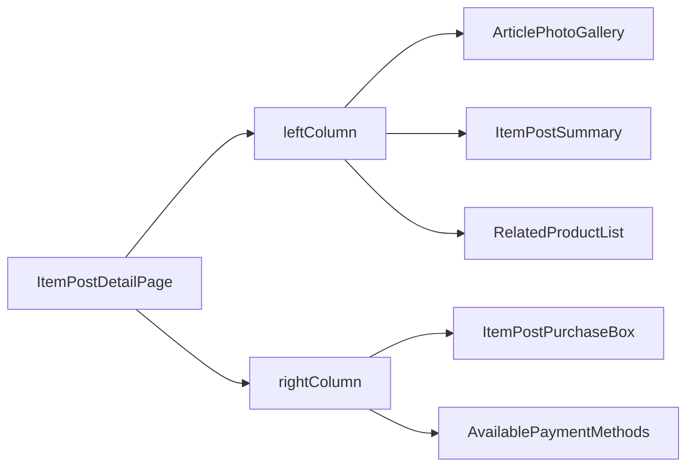
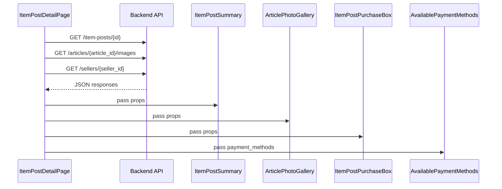

# 🧩 Frontend Documentation

## 📘 Overview

This document describes the frontend implementation of the product detail page, modeled after Mercado Libre’s interface. It follows a component-based design using React with modular CSS and Vite.

## 🛠️ Tech Stack

* ⚛️ **React.js**: A JavaScript library for building user interfaces using reusable components.
* 🌐 **React Router**: Enables dynamic routing in React applications, allowing for page navigation based on URL changes.
* ⚡ **Vite**: A fast build tool and development server optimized for modern frontend workflows.
* 🎨 **CSS Modules**: A styling approach that scopes CSS by default, preventing naming collisions and improving maintainability.

## 🧱 Structure

The layout is divided into a two-column design:

### 🧩 Components

* `ArticlePhotoGallery`: Displays image carousel.
* `ItemPostSummary`: Shows article title, rating, and key info.
* `ItemPostPurchaseBox`: Manages stock, quantity selection, delivery options, and seller reputation.
* `RelatedProductList`: Fetches related `itemPosts` excluding current.
* `AvailablePaymentMethods`: Displays payment method icons, only if corresponding image exists in `public/icons/payment/`. Icons currently supported include:

  * `master-card.svg`
  * `mercado-pago.svg`
  * `visa-debit.svg`
  * `visa.svg`

### 🔄 API Usage and Data Flow

All necessary data is fetched in the page component (`ItemPostDetailPage`) and passed down via props to each child component. This avoids unnecessary re-fetching and keeps components pure and focused.

* **Efficient usage:**

  * Calls are batched and parallelized using `Promise.all`.
  * Fetching is triggered only once on mount.
  * Components are memoized or kept as stateless as possible.

## 🎯 Design Decisions

* Components split by layout column to isolate responsibility.
* Reused existing APIs for images, itemPost, and article data.
* Conditional rendering based on data presence to allow graceful degradation.
* Centralized data fetching improves performance and simplifies debugging.

## 🚧 Challenges

* Matching Mercado Libre’s UX while maintaining modularity.
* Handling variant images and related product fetch efficiently.
* Passing down props in a clean and maintainable way while respecting performance constraints.
